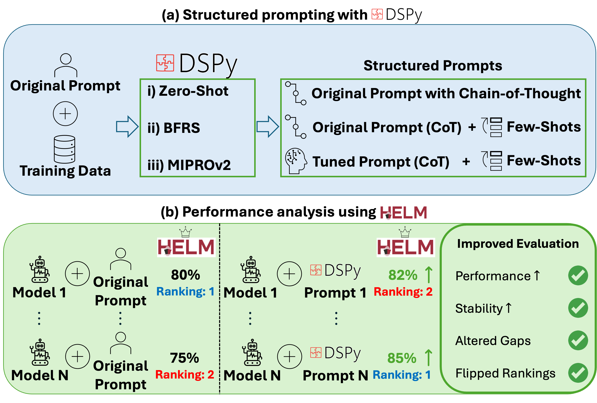

# Structured Prompting Enables More Robust Evaluation of Language Models

[](https://arxiv.org/abs/2511.20836)
[](LICENSE)



**Figure 1** | **Pipeline overview**. (a) DSPy takes HELM's baseline prompt and produces structured prompt variants. (b) HELM evaluates models under each prompt variant. With structured prompting, we observe more robust performance evaluation.

## What is DSPy-HELM?

A comprehensive framework for optimizing language model performance on benchmarks using DSPy, enabling more robust evaluation. This toolkit allows automated prompt optimization (APO) for benchmarks from the HELM (Holistic Evaluation of Language Models) ecosystem.

## Installation

```bash
# Clone the repository
git clone https://github.com/StanfordMIMI/dspy-helm.git
cd dspy-helm

# Install dependencies
pip install -r requirements.txt
```

## Basic Usage

**Configure settings** in `run.sh`:
```bash
scenarios=("mmlu_pro" "gpqa" "gsm8k" "medcalc_bench" "medec" "head_qa" "medbullets")
optimizers=("MIPROv2" "BootstrapFewShotWithRandomSearch")

# Language model to be optimized
model=openai/gpt-4o
api_base="your_api_base_here"
api_key="your_api_key_here"

# Teacher language model for proposing instruction candidates (MIPROv2)
prompt_model=openai/gpt-4o
prompt_api_base="your_api_base_here"
prompt_api_key="your_api_key_here"

max_bootstrapped_demos=3
max_labeled_demos=3
num_threads=1
```

**Run optimization**:
```bash
./run.sh
```

## 📊 Supported Benchmarks

| Benchmark         | Input → Output                        | Task                   |
|-------------------|--------------------------------------|------------------------|
| MMLU-Pro          | Reasoning Question → Answer           | Multi-Task Reasoning   |
| GPQA              | Graduate Question → Answer            | Graduate-Level QA      |
| GSM8K             | Math Problem → Solution               | Numeric Problem-Solving|
| MedCalc-Bench     | Patient Note → Computed Value         | Computational Reasoning|
| Medec             | Medical Narrative → Errors            | Error Classification   |
| HeadQA            | Medical Question → Answer             | USMLE-Style QA         |
| MedBullets        | Medical Question → Answer             | USMLE-Style QA         |

## Optimization Parameters

- `--max_bootstrapped_demos`: Number of bootstrapped demonstrations
- `--max_labeled_demos`: Number of labeled demonstrations
- `--num_threads`: Parallel processing threads (default: 16)

## 📁 Project Structure

```
dspy-helm/
├── main.py              # Main optimization script
├── scenarios.py         # Benchmark implementations
├── run.sh               # Batch optimization runner
├── requirements.txt     # Python dependencies
├── agents/              # Optimized DSPy agents
│   ├── medcalc_bench/
│   ├── head_qa/
│   ├── medbullets/
│   └── ...
└── README.md            # This file
```

## 📈 Results and Evaluation

Optimized agents are automatically saved to the `agents/` directory:

```
agents/
└── {scenario}/
    └── {model_name}/
        ├── MIPROv2.json
        └── BootstrapFewShotWithRandomSearch.json
```

## Creating Custom Scenarios

To add a new HELM benchmark:

**Implement the scenario class** in `scenarios.py`:
```python
class my_benchmark:
    def __init__(self, test_size=0.1, seed=42):
        self.test_size = test_size
        self.seed = seed
    
    @staticmethod
    def make_prompt(row):
        return f"Question: {row['question']}\nAnswer:"
    
    @staticmethod
    def metric(example, pred, trace=None):
        # Your evaluation metric
        return dspy.evaluate.metrics.answer_exact_match(example, pred, trace)
    
    def load_data(self):
        # Load and return trainset, valset
        pass
```

## 🙏 Acknowledgments

This repository is built using [DSPy](https://github.com/stanfordnlp/dspy) for prompt optimization.

## 📎 Citation

If you find this repository useful for your work, please cite the following paper:

```bibtex
@article{aali2025structured,
  title={Structured Prompting Enables More Robust Evaluation of Language Models},
  author={Aali, Asad and Mohsin, Muhammad Ahmed and Bikia, Vasiliki and Singhvi, Arnav and Gaus, Richard and Bedi, Suhana and Cui, Hejie and Fuentes, Miguel and Unell, Alyssa and Mai, Yifan and others},
  journal={arXiv preprint arXiv:2511.20836},
  year={2025}
}
```
